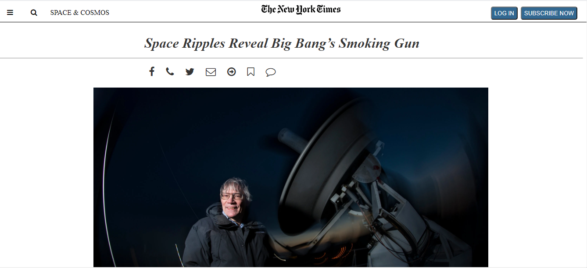

# New York Times Article Clone

This project is a clone of New York Times Article. In this Project i used icons, images, videos, paragraphs. In CSS you can see selectors, classes, and hover property. And I have used icons without local file, used link in place of it.

<h5>HTML tags that used in this project</h5>
<ol>
<li>html</li>
<li>head</li>
<li>body</li>
<li>main</li>
<li>header</li>
<li>aside</li>
<li>footer</li>
<li>video</li>
<li>iframe</li>
<li>img</li>
<li>div</li>
<li>etc</li>
</ol>
<h5>CSS selectors that used in this project</h5>
<ol>
<li>html tags</li>
<li>classes</li>
<li>hover property</li>
<li>etc</li>
</ol>

<h3>Built With</h3>
    <li>Major languages:
        <ol>
            <li>HTML</li>
            <li>CSS</li>
        </ol>
    </li>
    <li>Technologies used:
        <ol>
            <li>Visual Studio Code</li>
            <li>HTML&CSS linters</li>
            <li>Live Server extension</li>
        </ol>
    </li>
## Live Demo

    <a href="https://abdumurodovazulfizar.github.io/NYT-article/">Live Dome Link</a>
    
## Getting Started

To get a local copy up and running follow these simple steps.

- `git clone https://github.com/AbdumurodovaZulfizar/NYT-article.git`
- `cd NYT-article`
- Open this repository on your device

## Prerequisite

    1. Code editor
    2. Browser
    3. Live Server

## Authors

👩🏻‍💼 **Zulfizar Abdumurodova**

- GitHub: [Zulfizar Abdumurodova](https://github.com/AbdumurodovaZulfizar)
- Twitter: [Zulfizar Abdumurodova](https://twitter.com/Zulfiza70357085)
- LinkedIn: [Zulfizar Abdumurodova](https://www.linkedin.com/in/zulfizar-abdumurodova-a61527206/)

## 🤝 Contributing

Contributions, issues, and feature requests are welcome!

## Show your support

Give a ⭐️ if you like this project!

## Acknowledgments

- [Microverse](https://www.microverse.org/) for international opportunities and their `README` [template](https://github.com/microverseinc/readme-template).

## 📝 License

Copyright 2021 Zulfizar Abdumurodova
- [ISC License](https://github.com/AbdumurodovaZulfizar/NYT-article/blob/main/LICENSE.md) for this project.
